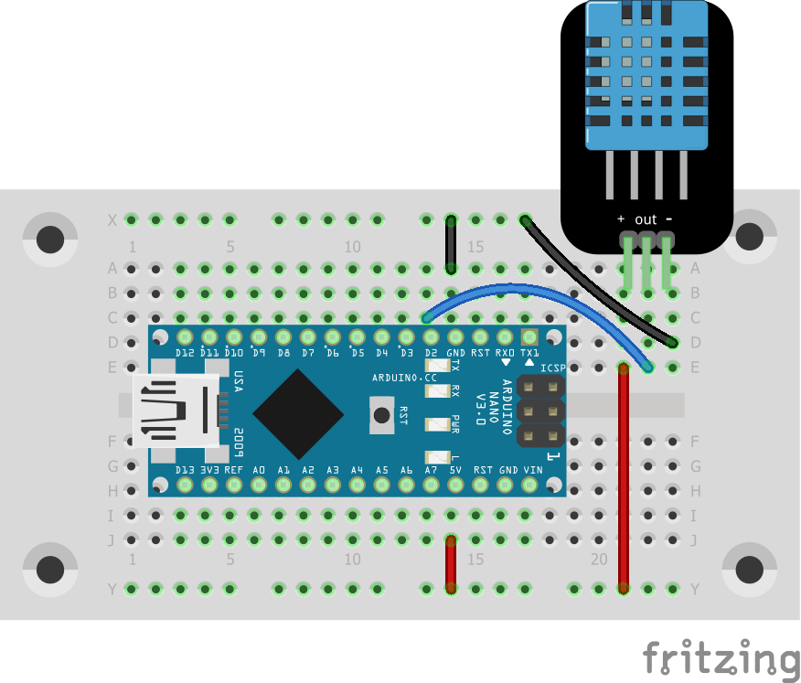

# read temperature and humidity with the arduino nano

This programm reads the temperature and humidity of an DHT-11 or DHT-12 sensor
and writes it to the serial interface.

See my blog post (in German) for
[more information](https://blog.rolandbaer.ch/2020/03/07/temperatur-und-luftfeuchtigkeit-messen-mit-dem-arduino-nano/).

To run the program you should it connect like in the schema below. Take care
of the DHT-11 or DHT-12 version you have. Mine had the connectors
VCC / Data / GND, but there are also modules with Data / VCC / GND!

