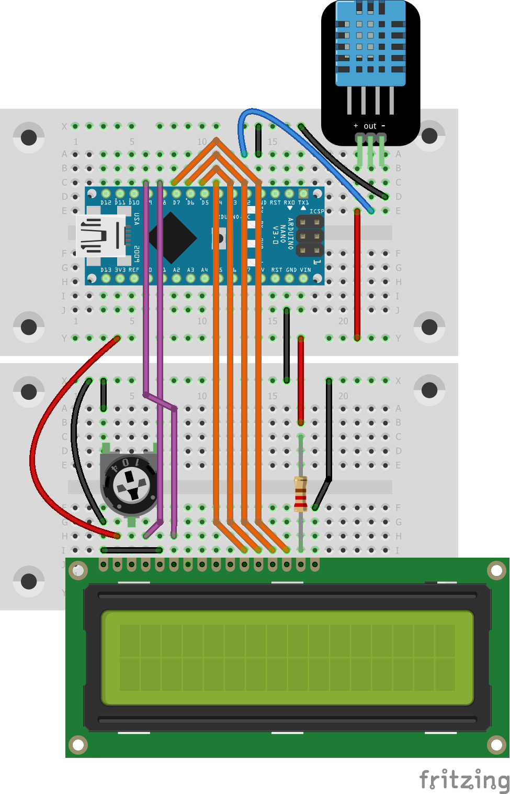

# read and show temperature and humidity with the arduino nano

This programm reads the temperature and humidity of an DHT-11 or DHT-12 sensor
and shows it on the connected display. The installation is still powered via 
the usb port of the arduino nano.

See my blog post (in German) for
[more information](https://blog.rolandbaer.ch/2020/03/23/temperatur-und-luftfeuchtigkeit-messen-und-anzeigen-mit-dem-arduino-nano/).

To run the program you should it connect like in the schema below. Take care
of the DHT-11 or DHT-12 version you have. Mine had the connectors
VCC / Data / GND, but there are also modules with Data / VCC / GND!
Ensure also that you have a HD44780 Compatible LCD Module (see the 
table after the schema) or adapt the schema to match your components.

Pin assignment of a HD44780 Compatible LCD Module

| Pin | Function | Description                                                           |
| --- | -------- | --------------------------------------------------------------------- |
|   1 | VSS      | Ground line power supply 0 V                                          |
|   2 | VDD      | Power supply +5 V                                                     |
|   3 | V0       | Contrast adjustment, 0 V 5 V Potentiometers                           |
|   4 | RS       | Select tab Pin D8                                                     |
|   5 | RW       | Read/Write, if nothing is read from the LCD module, connection to 0 V |
|   6 | E        | Enable (changeover signal) Pin D9                                     |
|   7 | D0       | Data bit 0 (not required in 4-bit mode)                               |
|   8 | D1       | Data bit 1 (not required in 4-bit mode)                               |
|   9 | D2       | Data bit 2 (not required in 4-bit mode)                               |
|  10 | D3       | Data bit 3 (not required in 4-bit mode)                               |
|  11 | D4       | Data bit 4 Pin D4                                                     |
|  12 | D5       | Data bit 5 Pin D5                                                     |
|  13 | D6       | Data bit 6 Pin D6                                                     |
|  14 | D7       | Data bit 7 Pin D7                                                     |
|  15 | A        | Backlight, 560 Ohm series resistor required                           |
|  16 | K        | Backlight ground line                                                 |