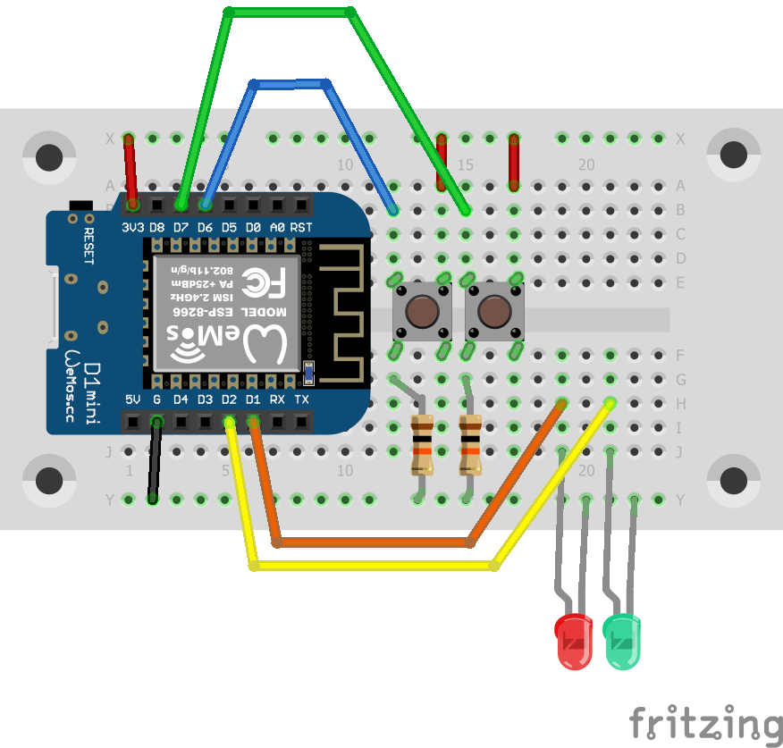

# first steps with the Wemos Lolin D1 mini

This programm is a small 'hello world'-like sample to get the board running.
It just reads the button states and shows it via LEDs.

See my blog post (in German) for
[more information](https://blog.rolandbaer.ch/2020/03/29/erste-schritte-mit-dem-wemos-d1-mini/).

To run the program you should it connect like in the schema below.

**Warning:** I used LEDs with built-in resistors. If you use normal LEDs don't
forget to add a matching resistor!

