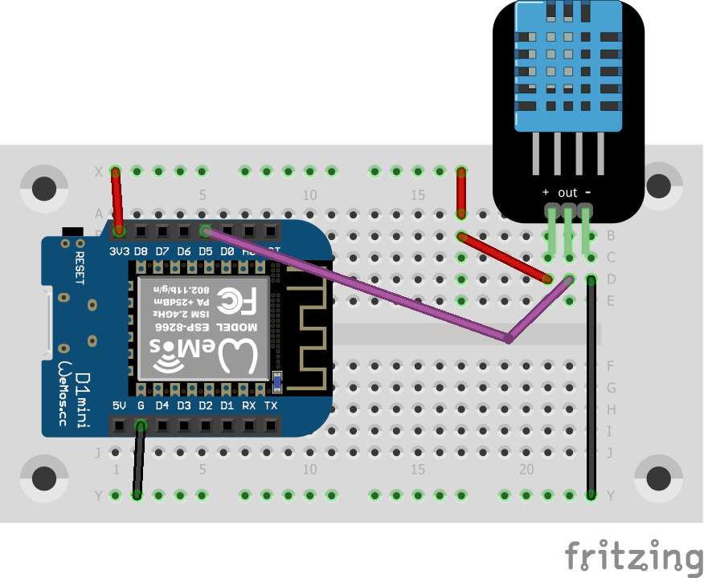

# webserver on the Wemos Lolin D1 mini

This programm runs a webserver on the Wemos Lolin D1 mini providing the 
temperature and humidity measured by a DHT-11.

Copy `credentials.h.sample` to `credentials.h` and change the ssid and
password to your WiFi network credentials.

See my blog post (in German) for
[more information](https://blog.rolandbaer.ch/2020/03/30/wemos-d1-mini-als-temperatur-und-luftfeuchtigkeits-webserver/).

To run the program you should it connect like in the schema below. Take care
of the DHT-11 or DHT-12 version you have. Mine had the connectors
VCC / Data / GND, but there are also modules with Data / VCC / GND!

