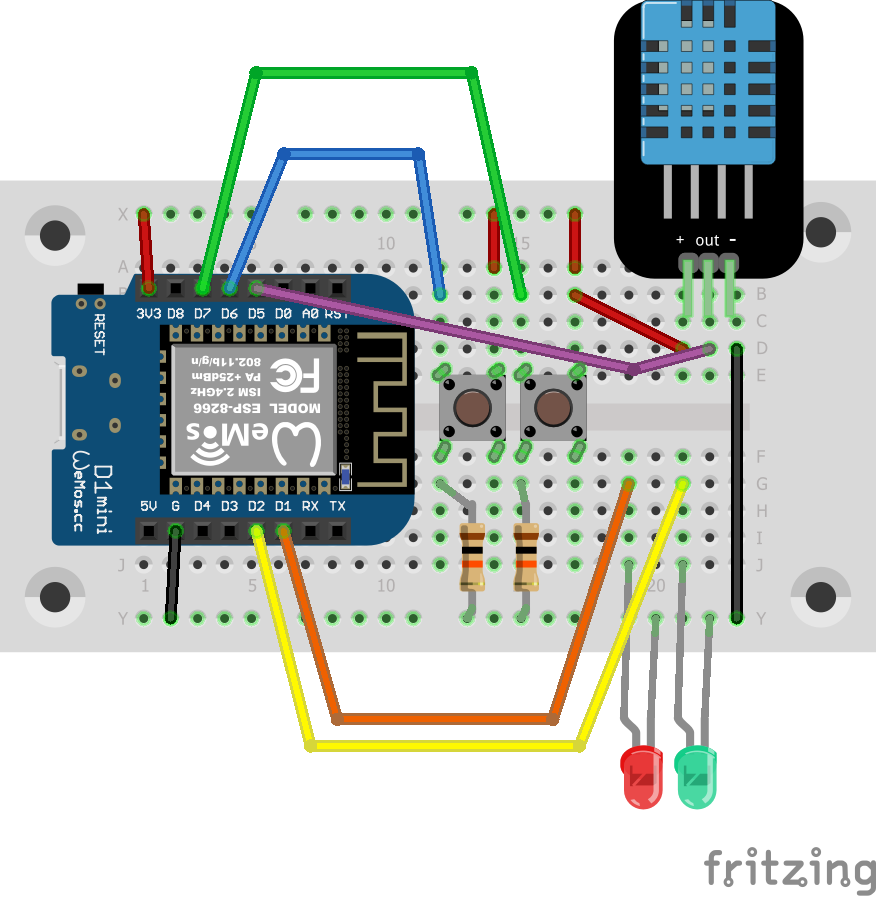

# state machine for window handling

This programm runs a state machine that handles a window with an electrified
opener/closer depending on two buttons and the measured values of a DHT-11
sensor. The program is intended to be run on a Wemos Lolin D1 mini.

With the two buttons on D6 (opening) and D7 (closing) the relays on D1
(opening) and D2 (closing) are controlled directly. The relays will be
connected only for the time needed by the motor to open or close the window
to ease the stress on relays and motor.

As soon as the humidity or temperature is under a defined level the window is
closed automatically.

To run the program you should it connect like in the schema below. Take care
of the DHT-11 or DHT-12 version you have. Mine had the connectors
VCC / Data / GND, but there are also modules with Data / VCC / GND!

**Warning:** To simulate the relays I used LEDs with built-in resistors. If
you use normal LEDs don't forget to add a matching resistor!

